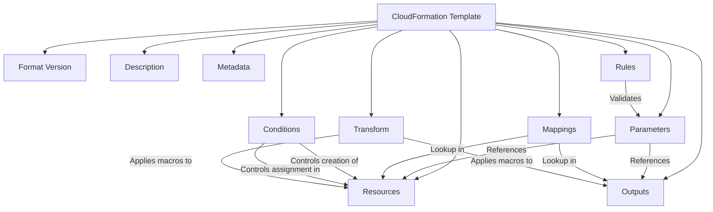

# Cloud Formation Templates (AWS)
>> https://docs.aws.amazon.com/AWSCloudFormation/latest/UserGuide/Welcome.html


## How to write perfect template?
* Follow the Template formats to get used to it.
* Also checkout Template anotomy for clear understanding.
* Even though if you don't follow rules to organise template is valid for other details, descriptions, metadata, and etc.
* But Resources section should be must, becuase we are using CFT to create resources right.


## A Sample template to create EC2 Instance:

```
AWSTemplateFormatVersion: 2010-09-09
Description: A sample CloudFormation template with YAML comments.
# Resources section
Resources:
  MyEC2Instance: 
    Type: AWS::EC2::Instance
    Properties: 
      # Linux AMI
      ImageId: ami-1234567890abcdef0 
      InstanceType: t2.micro
      KeyName: MyKey
      BlockDeviceMappings:
        - DeviceName: /dev/sdm
          Ebs:
            VolumeType: io1
            Iops: 200
            DeleteOnTermination: false
            VolumeSize: 20
```


# AWS CloudFormation Template Anatomy

An AWS CloudFormation template is a JSON or YAML formatted text file that describes the infrastructure and resources you want to provision in AWS. Every template consists of one or more **sections**, each serving a specific purpose. Understanding these sections helps you create flexible, maintainable, and reusable templates.

---

## 1. Resources (Required)

The **Resources** section is the **core of every CloudFormation template**. It specifies the AWS resources to be created in your stack, along with their configurations.

* **Purpose:** Define all AWS resources (like EC2 instances, S3 buckets, RDS databases) that will be deployed.
* **Key Components:**
  * **Logical ID:** A unique identifier for the resource in the template.
  * **Type:** The AWS resource type (e.g., `AWS::EC2::Instance`, `AWS::S3::Bucket`).
  * **Properties:** Configuration details specific to the resource.

**Example:**

```yaml
Resources:
  MyS3Bucket:
    Type: AWS::S3::Bucket
    Properties:
      BucketName: my-sample-bucket
```

---

## 2. Parameters (Optional)

The **Parameters** section allows templates to be **dynamic and customizable** at stack creation time.

* **Purpose:** Accept input values from users without modifying the template.
* **Use Cases:**
  * Specifying instance types, storage sizes, or environment settings.
  * Reusing templates across different environments (e.g., dev, test, prod).
* **How it Works:** Values are referenced in `Resources` and `Outputs`.

**Example:**

```yaml
Parameters:
  InstanceType:
    Type: String
    Default: t2.micro
    AllowedValues:
      - t2.micro
      - t2.small
      - t2.medium
    Description: EC2 instance type
```

---

## 3. Outputs (Optional)

The **Outputs** section defines values returned **after stack creation**. These are useful for retrieving information about resources.

* **Purpose:** Provide information like resource IDs, ARNs, or URLs.
* **Use Cases:**
  * Pass information to other stacks.
  * Retrieve endpoints of newly created services.

**Example:**

```yaml
Outputs:
  WebsiteURL:
    Description: URL of the website
    Value: !Sub "http://${MyS3Bucket}.s3-website-${AWS::Region}.amazonaws.com"
```

---

## 4. Mappings (Optional)

**Mappings** are static **lookup tables** in the template.

* **Purpose:** Return specific values based on keys such as region, environment, or instance type.
* **Use Cases:** Avoid hardcoding values; adjust settings per region or environment.
* **Integration:** Use `Fn::FindInMap` to reference mapping values in `Resources` or `Outputs`.

**Example:**

```yaml
Mappings:
  RegionMap:
    us-east-1:
      AMI: ami-0ff8a91507f77f867
    us-west-2:
      AMI: ami-0bdb828fd58c52235
```

---

## 5. Metadata (Optional)

**Metadata** provides additional information about the template.

* **Purpose:** Store annotations, deployment hints, or tool-specific instructions.
* **Example Uses:** Informational notes, deployment scripts, or automation tools.

**Example:**

```yaml
Metadata:
  Version: "1.0"
  Author: "Jane Doe"
```

---

## 6. Rules (Optional)

The **Rules** section allows **parameter validation**.

* **Purpose:** Ensure that parameter values or combinations meet specific criteria.
* **Use Cases:** Limit choices or enforce policies during stack creation.

**Example:**

```yaml
Rules:
  ValidInstanceType:
    Assertions:
      - Assert: !Or
          - !Equals [ !Ref InstanceType, t2.micro ]
          - !Equals [ !Ref InstanceType, t2.small ]
```

---

## 7. Conditions (Optional)

**Conditions** let you **control resource creation or property assignment** based on conditions.

* **Purpose:** Make templates adaptable to different environments or configurations.
* **Use Cases:** Deploy resources only in `prod` environment or enable optional features.

**Example:**

```yaml
Conditions:
  IsProduction:
    !Equals [ !Ref EnvironmentType, prod ]

Resources:
  ProductionBucket:
    Type: AWS::S3::Bucket
    Condition: IsProduction
```

---

## 8. Transform (Optional)

The **Transform** section applies **macros** during template processing.

* **Purpose:** Extend template functionality.
* **Use Cases:**
  * Use **AWS SAM** for serverless applications.
  * Include external template snippets with `AWS::Include`.

**Example (AWS SAM):**

```yaml
Transform: 'AWS::Serverless-2016-10-31'
Resources:
  MyFunction:
    Type: AWS::Serverless::Function
    Properties:
      Handler: index.handler
      Runtime: nodejs14.x
```

---

## 9. Format Version (Optional)

* **Purpose:** Specify the template version. Currently, only `2010-09-09` is recognized.

**Example:**

```yaml
AWSTemplateFormatVersion: '2010-09-09'
```

---

## 10. Description (Optional)

* **Purpose:** Provide a textual description of the template.

**Example:**

```yaml
Description: >
  This CloudFormation template deploys a basic web application
  including an EC2 instance and S3 bucket for static content.
```

---

## Summary Table

| Section        | Required   | Purpose                                             |
| -------------- | ---------- | --------------------------------------------------- |
| Resources      | ✅ Yes      | Defines all AWS resources in the stack              |
| Parameters     | ❌ Optional | Accept runtime input to customize template          |
| Outputs        | ❌ Optional | Return useful information after stack creation      |
| Mappings       | ❌ Optional | Lookup tables for conditional values                |
| Metadata       | ❌ Optional | Additional info or annotations                      |
| Rules          | ❌ Optional | Validate parameters and combinations                |
| Conditions     | ❌ Optional | Conditionally create resources or assign properties |
| Transform      | ❌ Optional | Apply macros, SAM, or include external snippets     |
| Format Version | ❌ Optional | Template version                                    |
| Description    | ❌ Optional | Explain the purpose of the template                 |

---

## CloudFormation Template Structure Diagram



---