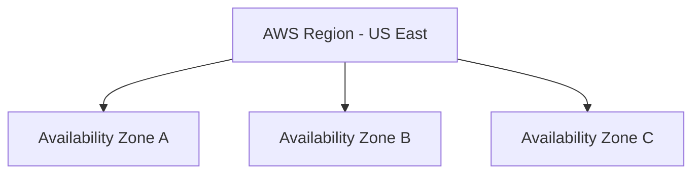
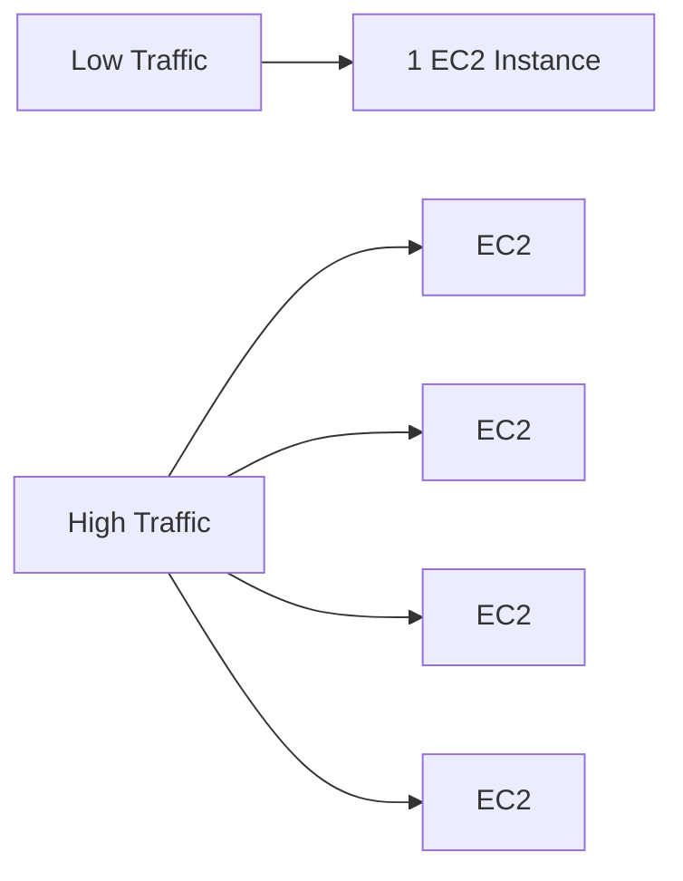

# ☁️ Amazon EC2 (Elastic Compute Cloud)

---

## 📌 What is EC2?

**Amazon EC2 (Elastic Compute Cloud)** is a cloud service that allows you to create and manage **virtual servers** in AWS.

In simple words:

- 👉 It is like renting a computer in the cloud.
- 👉 You choose the CPU, RAM, storage, and operating system.
- 👉 You start using it within minutes.
- 👉 You pay only for what you use.

An EC2 instance is:

- 🖥️ A virtual machine
- ⚙️ Equipped with CPU, RAM, storage, and networking
- 🌍 Hosted inside AWS data centers
- 🔐 Secure and accessible from anywhere

---

# 💻 Understanding EC2 with a Simple Example

## 🏠 Example: Your Physical Laptop

Your laptop has:

- CPU  
- RAM  
- Storage  

If multiple users need separate systems on the same machine:

- You install a **Hypervisor**
- It creates multiple **Virtual Machines (VMs)**
- Each VM runs independently

---

## 🧠 Local Virtualization Architecture (Mermaid)

```mermaid
flowchart TD
    A[Physical Machine<br>CPU RAM Storage]
    B[Hypervisor]
    C[VM 1 - Linux]
    D[VM 2 - Windows]
    E[VM 3 - Ubuntu]

    A --> B
    B --> C
    B --> D
    B --> E
````

Each VM behaves like a separate computer.

---

# ☁️ How AWS Provides EC2

AWS owns massive data centers with powerful physical servers.

They:

* Install virtualization software
* Divide powerful machines into smaller virtual servers
* Provide those virtual servers to customers

These virtual servers are called:

# 👉 EC2 Instances

---

## 🧠 AWS EC2 Architecture (Mermaid)

```mermaid
flowchart TD
    A[AWS Data Center]
    B[Powerful Physical Server<br>High CPU Large RAM]
    C[Virtualization Layer]
    D[EC2 Instance 1]
    E[EC2 Instance 2]
    F[EC2 Instance 3]
    G[EC2 Instance 4]

    A --> B
    B --> C
    C --> D
    C --> E
    C --> F
    C --> G
```

---

## 🛠️ What You Can Do with EC2

* ▶️ Launch an instance
* ⏹️ Stop it
* 🔁 Restart it
* 📈 Resize it
* ❌ Terminate it

All from the AWS Console or CLI.

---

# 🌍 Global Availability

AWS operates worldwide using:

* 🌎 **Regions** (geographical areas like US, Europe, Asia)
* 🏢 **Availability Zones (AZs)** inside each region

---

## 🌐 Region and AZ Structure (Mermaid)



### Why this matters:

* 🚀 Deploy closer to users for better performance
* 🔄 High availability
* 🛡️ Fault tolerance
* 🌐 Global application deployment

---

# 🔄 Why is it Called "Elastic"?

Elastic means flexible.

It can:

* 📈 Scale up when demand increases
* 📉 Scale down when demand decreases

You can manually resize instances or use **Auto Scaling** to scale automatically.

---

## 📊 Scaling Example (Mermaid)



This ability to grow and shrink automatically is called:

# 👉 Elasticity

---

# ⭐ Key Benefits of EC2

* 🚀 Launch servers in minutes
* 💰 Pay only for what you use
* 📈 Scale anytime
* 🌍 Deploy globally
* 🔐 Secure and reliable
* 🛠️ Full control over OS, size, and storage

---

# ☁️ What are types of EC2 instances?

Amazon EC2 instances are grouped based on what kind of workload they are best at handling:

- 🧩 **General Purpose**
- ⚡ **Compute Optimized**
- 🧠 **Memory Optimized**
- 💾 **Storage Optimized**
- 🚀 **Accelerated Computing**

---

# 🤔 Which type of EC2 instance to be used, why and when?

Below is a simple and practical guide for choosing the right instance type.

---

## 🧩 General Purpose Instances

**✅ Use when:**
- You need a balance of CPU, memory, and networking
- Running web servers 🌐
- Small to medium databases
- Development & testing environments 👨‍💻

**💡 Why:**
They provide a good mix of performance and cost. Perfect when your app doesn’t heavily depend on just one resource.

**📝 Example:**
Hosting a Node.js, Django, or simple backend application.

---

## ⚡ Compute Optimized Instances

**✅ Use when:**
- High-performance web servers
- Batch processing jobs
- Gaming servers 🎮
- Scientific modeling

**💡 Why:**
Designed for CPU-intensive workloads. If your app constantly uses high CPU, this is your best choice.

**📝 Example:**
Video encoding or processing thousands of requests per second.

---

## 🧠 Memory Optimized Instances

**✅ Use when:**
- High-performance databases 📊
- In-memory caching (Redis, Memcached)
- Real-time big data analytics
- Enterprise applications

**💡 Why:**
They provide large amounts of RAM. Ideal when your application keeps lots of data in memory.

**📝 Example:**
Running a large MySQL or PostgreSQL database.

---

## 💾 Storage Optimized Instances

**✅ Use when:**
- Big data workloads
- Data warehousing
- Log processing 📂
- NoSQL databases (Cassandra, MongoDB)

**💡 Why:**
Optimized for high disk throughput and IOPS. Perfect when fast and frequent disk access is required.

**📝 Example:**
Processing terabytes of log files daily.

---

## 🚀 Accelerated Computing Instances

**✅ Use when:**
- Machine learning & AI 🤖
- Graphics rendering
- Video processing
- Scientific simulations

**💡 Why:**
They use GPUs or specialized hardware (like FPGAs) to accelerate heavy computations.

**📝 Example:**
Training deep learning models using TensorFlow or PyTorch.

---

# 🎯 Quick Selection Guide

| If your app needs mostly… | Choose this instance type |
|----------------------------|----------------------------|
| Balanced resources | 🧩 General Purpose |
| High CPU power | ⚡ Compute Optimized |
| Large RAM | 🧠 Memory Optimized |
| Fast disk performance | 💾 Storage Optimized |
| GPU / hardware acceleration | 🚀 Accelerated |

---

💡 **Tip:** If you're unsure, start with 🧩 **General Purpose**, monitor performance 📈, and scale or switch based on real usage.
 

---

# 🧾 Quick Summary

Amazon EC2 allows you to:

* Create virtual machines in the cloud
* Scale resources up or down anytime
* Deploy applications worldwide
* Avoid buying and maintaining physical hardware

---

# 🏁 Final Thoughts

EC2 gives you:

* 🖥️ The power of a physical server
* ☁️ The flexibility of the cloud
* 💰 Cost-efficient pay-as-you-go pricing

All delivered as an on-demand cloud service.

