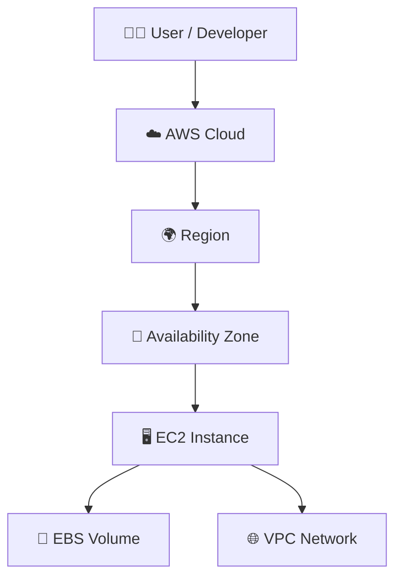
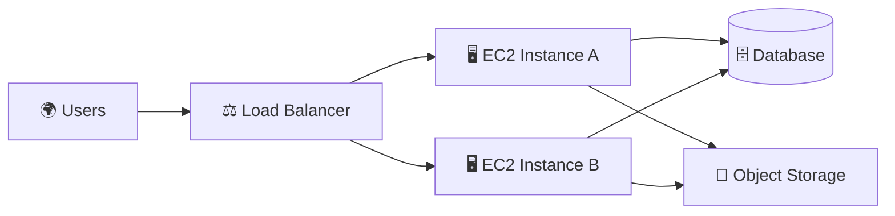
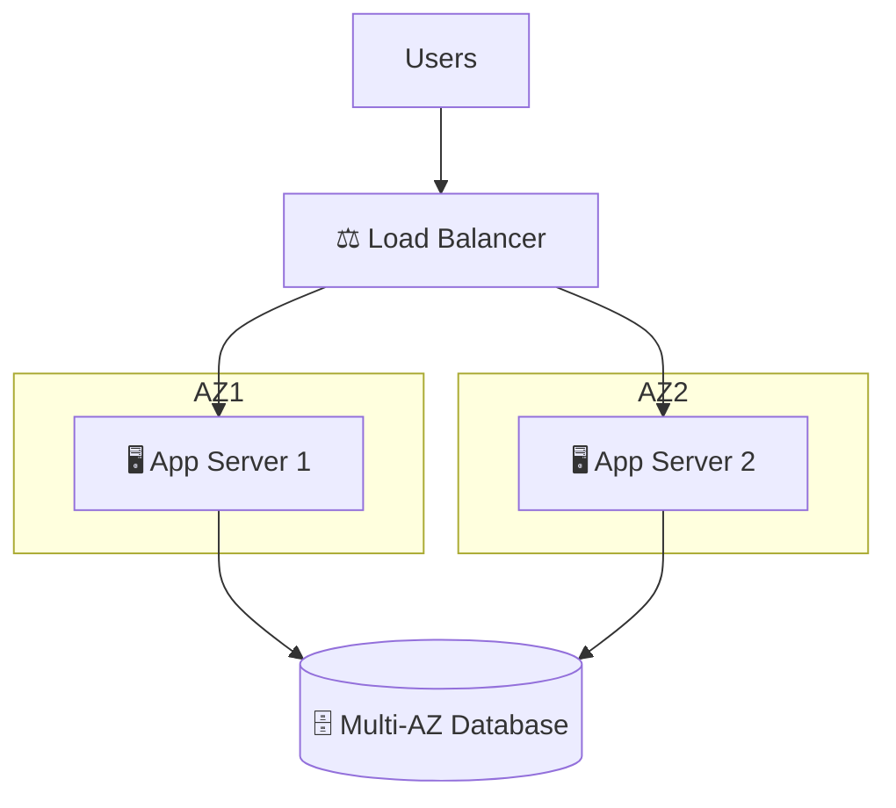
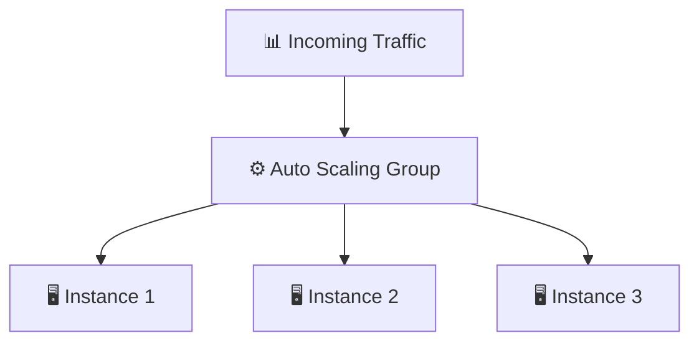
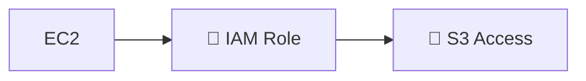

# 🖥️ Amazon EC2 – Complete Beginner to Production Guide

> Learn EC2 using a simple story:  
> ☕ The Internet Café Model → ☁️ Modern Cloud Servers

---

# 📖 The Story: Internet Cafés & EC2

In the early days of the internet:

- 🏬 You went to an **Internet Café**
- 🪑 You picked an available computer
- ⏳ You used it for some time
- 💵 You paid only for the hours used
- 🔌 When you left, the system was available for someone else

You didn’t:
- Buy the computer
- Maintain it
- Install hardware
- Pay electricity bills

You simply **used it when needed**.

---

# ☁️ What is Amazon EC2?

**Amazon EC2 (Elastic Compute Cloud)** works the same way.

Instead of renting a physical computer in a café,  
you rent a **virtual computer (server)** in the cloud.

You:
- Choose configuration (CPU, RAM, OS)
- Launch it in minutes
- Use it to run applications
- Pay only while it runs
- Stop or terminate when done

---

# 🧠 EC2 in Simple Words

> EC2 = Renting virtual servers on demand.

It allows you to:
- Host websites
- Run backend APIs
- Process data
- Run batch jobs
- Deploy enterprise applications
- Create development environments

---

# 🏗️ How EC2 Works (Architecture Overview)

### 📝 Explanation

- 🌍 Region → Geographic location
- 🏢 Availability Zone → Isolated data center
- 🖥️ EC2 → Virtual Server
- 💾 EBS → Persistent storage
- 🌐 VPC → Private network

---

# 🚀 Step-by-Step: Launching an EC2 Instance

## ✅ Step 1: Choose AMI (Operating System)

AMI = Amazon Machine Image

Examples:
- Amazon Linux
- Ubuntu
- Windows Server

This is like choosing:
> “Do you want Windows or Linux in the internet café?”

---

## ✅ Step 2: Choose Instance Type

Instance type defines:
- CPU
- Memory
- Network performance

---

## ✅ Step 3: Configure Network

- Select VPC
- Choose Subnet
- Assign Public IP (if needed)

---

## ✅ Step 4: Add Storage

Default:
- EBS Volume (root disk)

Optional:
- Additional data disks

---

## ✅ Step 5: Configure Security Group

Security Group = Firewall

Example:
- Allow port 22 (SSH)
- Allow port 80 (HTTP)
- Allow port 443 (HTTPS)

---

## ✅ Step 6: Create / Select Key Pair

Used for:
- Secure login via SSH

---

## ✅ Step 7: Launch

Instance starts in:
- 30–60 seconds

You now have a running server 🎉

---

# 🌍 EC2 in Production Architecture

---

## 🏢 Production Best Practice Architecture

### Key Concepts:

- Multi-AZ Deployment
- High Availability
- Load Balancing
- Auto Scaling

---

# 📈 Auto Scaling with EC2

When traffic increases:
- New instances launch automatically

When traffic decreases:
- Extra instances terminate

---

# 🧩 Most Common EC2 Instance Types

| Category | Use Case |
|----------|----------|
| t3 / t4g | General purpose, dev/test |
| m6i      | Balanced compute & memory |
| c6i      | Compute optimized |
| r6i      | Memory optimized |
| i3       | High I/O workloads |
| g5       | GPU workloads |
| p4       | Machine learning |

---

# 🔐 Security Best Practices

## 1️⃣ Use IAM Roles (Never hardcode credentials)

---

## 2️⃣ Restrict Security Groups

❌ Don’t allow 0.0.0.0/0 on SSH  
✅ Allow only your IP

---

## 3️⃣ Use Private Subnets

Production apps:
- EC2 in private subnet
- Access via Load Balancer or Bastion host

---

## 4️⃣ Enable Encryption

- EBS encryption
- TLS/HTTPS
- Encrypted backups

---

## 5️⃣ Patch Regularly

- Use Systems Manager (SSM)
- Automate patching

---

# 🛠️ Tools Used in Industry

| Tool | Purpose |
|------|---------|
| AWS Console | Manual provisioning |
| AWS CLI | Command line control |
| Terraform | Infrastructure as Code |
| CloudFormation | AWS native IaC |
| Ansible | Configuration management |
| Packer | Create custom AMIs |
| CloudWatch | Monitoring |
| AWS Systems Manager | Remote management |

---

# 🧹 Deprovisioning Best Practices

When shutting down:

1. Backup important data
2. Create AMI if needed
3. Detach EBS if required
4. Terminate instance
5. Remove unused Elastic IP
6. Clean up security groups

---

# 💰 Cost Optimization Tips

- Use Auto Scaling
- Use Spot Instances
- Stop non-production at night
- Use Reserved Instances for steady workloads
- Monitor with Cost Explorer

---

# 🏭 Real Production Example

E-commerce website:

- ALB distributes traffic
- EC2 runs backend API
- RDS stores transactions
- S3 stores images
- CloudWatch monitors health
- Auto Scaling handles traffic spikes

---

# 🎯 EC2 Summary

| Internet Café ☕ | Amazon EC2 ☁️ |
|-----------------|---------------|
| Rent computer | Rent virtual server |
| Pay per hour | Pay per second/hour |
| Choose system | Choose AMI |
| Secure login | SSH with Key Pair |
| Shared building | AWS Region |
| Multiple rooms | Availability Zones |

---

# 🚀 Final Takeaway

EC2 gives you:

- Elastic scalability
- Pay-as-you-go pricing
- Full OS-level control
- Enterprise-grade security
- Production-ready architecture

It is the foundation of:
- Web applications
- Enterprise systems
- Dev/Test environments
- Scalable cloud infrastructure

---

🎉 You now understand EC2 from beginner story → production architecture → industry best practices.

Ready to launch your first production-grade EC2 workload!
