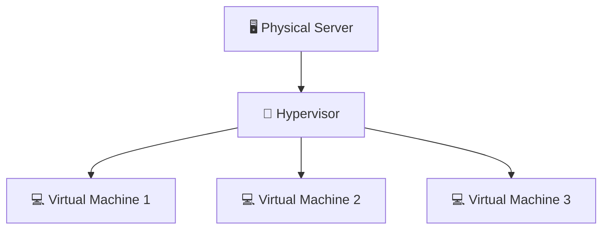
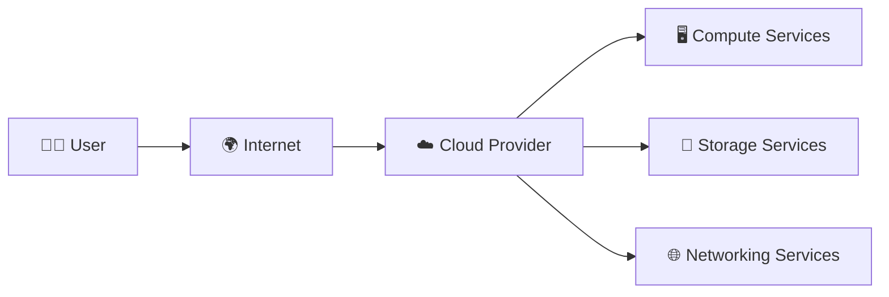
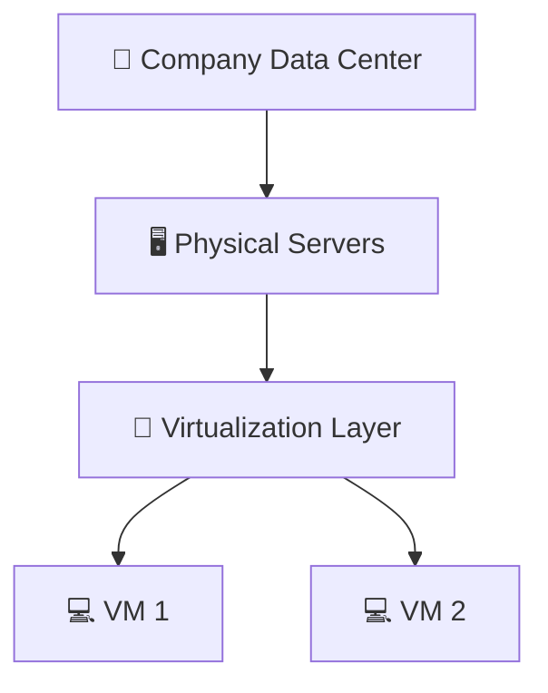
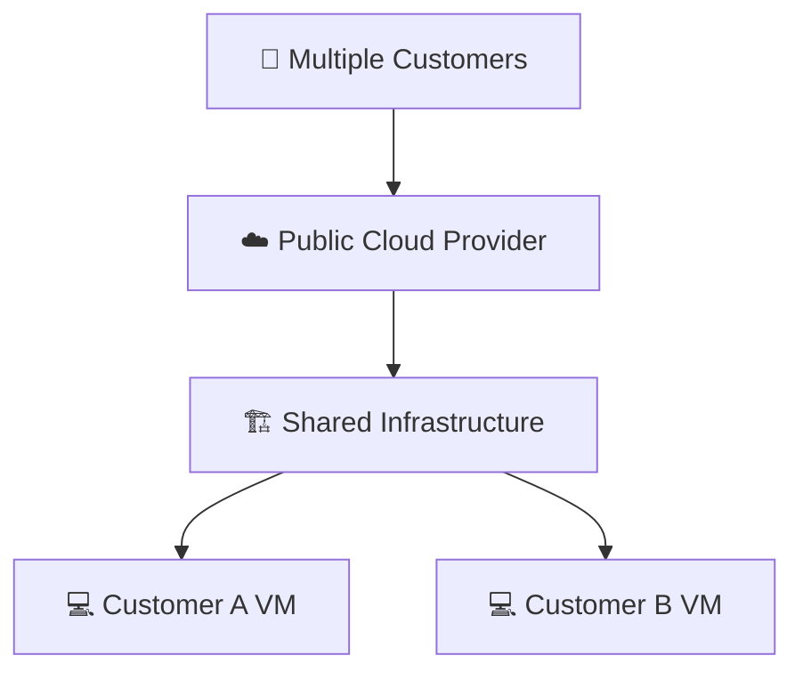
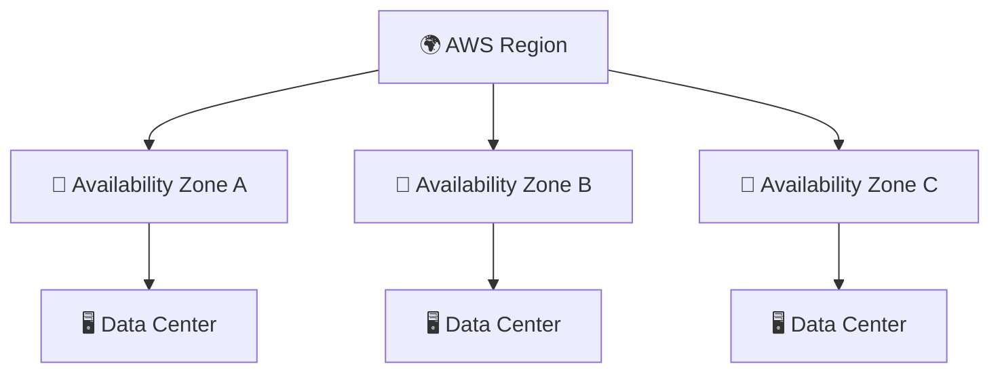
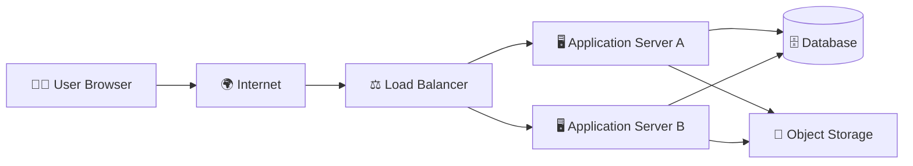
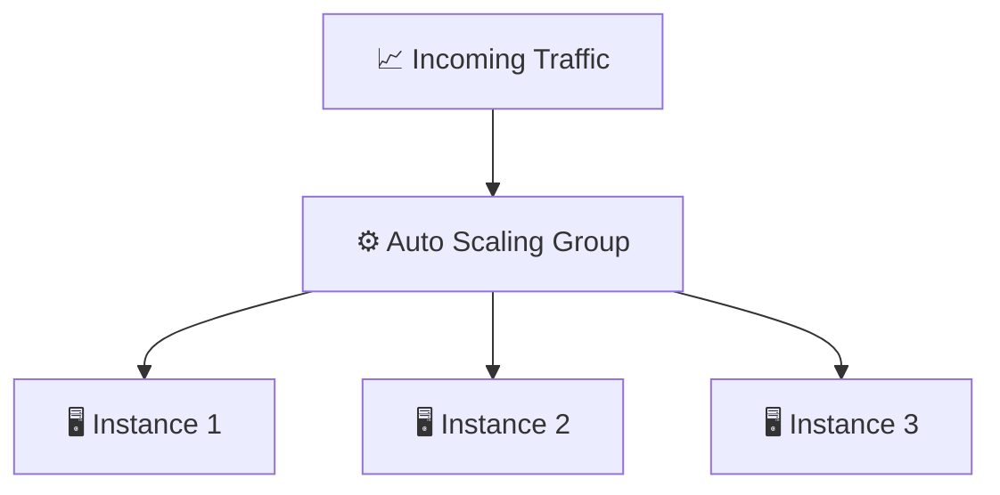
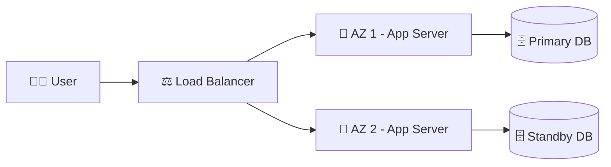

# ☁️ Cloud Computing – Diagram & Architecture Visual Guide

This section visually explains:
- Virtualization
- Cloud Model
- Private vs Public Cloud
- AWS Global Infrastructure
- Basic Cloud Architecture

---

# 🎛️ 1. Virtualization Diagram

## 💡 One Physical Server → Many Virtual Machines

### 📝 Explanation

- 🖥️ One powerful physical machine  
- 🧠 Hypervisor divides hardware resources  
- 💻 Multiple Virtual Machines run independently  
- Each VM behaves like a separate computer  

👉 This is the foundation of Cloud Computing.

---

# ☁️ 2. What is Cloud? (High-Level Diagram)

### 📝 Explanation

Users connect to the cloud through the internet and rent:

- 🖥️ Compute power  
- 💾 Storage  
- 🌐 Networking  

Instead of buying physical infrastructure.

---

# 🏠 3. Private vs 🌍 Public Cloud Architecture

## 🏠 Private Cloud

### Characteristics

- Owned by a single organization  
- Managed internally  
- Full control  
- Higher cost  

---

## 🌍 Public Cloud

### Characteristics

- Shared infrastructure  
- Pay-as-you-go model  
- Managed by provider  
- Highly scalable  

---

# 🌎 4. AWS Global Infrastructure Architecture

### 📝 Explanation

- 🌍 Region → Geographic area  
- 🏢 Availability Zone → Isolated data center cluster  
- 🖥️ Data Center → Physical servers  

Applications run across multiple AZs for high availability.

---

# 🏗️ 5. Basic Cloud Application Architecture

### 🔎 Component Overview

- 🌍 Internet → Entry point  
- ⚖️ Load Balancer → Distributes traffic  
- 🖥️ Application Servers → Run application logic  
- 🗄️ Database → Stores structured data  
- 💾 Object Storage → Stores files & backups  

---

# 📈 6. Auto Scaling Architecture

- Traffic increases → New instances launch automatically  
- Traffic decreases → Extra instances terminate  

👉 This ensures cost efficiency and performance.

---

# 🛡️ 7. High Availability Architecture

If one Availability Zone fails ❌  
The other continues serving users ✅  

Ensures:
- High Availability  
- Fault Tolerance  
- Business Continuity  

---

# 🎼 Music Story Mapping

| 🎸 Music Band Concept | ☁️ Cloud Equivalent |
|-----------------------|---------------------|
| Music Studio          | Data Center         |
| Rooms                 | Availability Zones  |
| Instruments           | Virtual Machines    |
| Studio Manager        | Cloud Provider      |
| Extra Instruments     | Auto Scaling        |
| Backup Generator      | Disaster Recovery   |

---

# 🎯 Final Takeaway

Cloud architecture is built on:

- 🧠 Virtualization  
- 🌍 Internet Connectivity  
- 🏗️ Distributed Infrastructure  
- 📈 Auto Scaling  
- 🛡️ High Availability  
- 💰 Pay-as-you-go Pricing  

---

🚀 You now understand Cloud visually and architecturally.  
Ready to start deploying on AWS!
