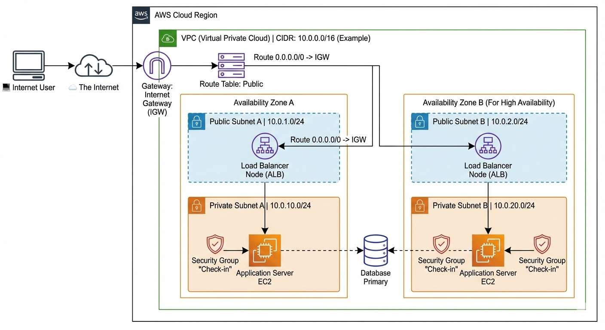

# Create VPC:
How to define size of the VPC?
- Its based on the IP/16 subnet IP/24 subnet range.
- To access resources in VPC, we need Gateway of subnets.
- We have public/private subnets.
    - Private subnetes does not have an any connection outside/inside.
    - Only through Public subnet, we can access or resources in VPC have internet connection through **Internet gateway**.
    - At the public subnet, we have load balencer to pass requests from outside to an application in VPC.
    - For that we need route tables, and route request to the target application.
    - Again **security group**, present near the application to get access.
    - We need to pass security check to finally to enter the application, like in Airport checkin.

```

1. Defining the VPC Size (The Foundation)
Before deploying resources, you must define the boundaries of your network using CIDR (Classless Inter-Domain Routing) notation.

The VPC CIDR (/16): This is the total IP address space for your entire virtual network.

Example: 10.0.0.0/16. This provides roughly 65,000 private IP addresses to use within AWS. Think of this as defining the outer walls of your data center house.

The Subnet CIDR (/24): You carve up the large VPC space into smaller chunks called subnets.

Example: 10.0.1.0/24. This provides 256 IP addresses (minus 5 AWS reserves for internal use). Think of these as individual rooms within the house.

2. The Gateways (The Doors)
A VPC by itself is isolated. To get traffic in or out, you need gateways.

Internet Gateway (IGW): This is the main front door for public internet traffic. Without an IGW attached to your VPC, nothing inside can talk to the internet, and nothing on the internet can talk to it.

3. Public vs. Private Subnets (The Zones)
The fundamental difference between a public and private subnet is defined by their Route Tables.

Public Subnet:

Definition: A subnet whose associated Route Table has a direct route to the Internet Gateway (IGW).

Role: This is the "DMZ" (Demilitarized Zone). Things placed here generally have public IP addresses and are meant to handle incoming traffic from the outside world (like Load Balancers or Bastion Hosts).

Private Subnet:

Definition: A subnet whose Route Table does not have a route to the IGW.

Role: These are secure zones. Resources here (like Application Servers or Databases) only have private IP addresses. They cannot be reached directly by the public internet. This is crucial for security.

4. The Traffic Flow: From Internet to Application
Let's trace a user request (the blue arrows in the diagram):

Step 1: The Entry The user types your website address into their browser. The request travels over the public internet and arrives at the border of your AWS Cloud.

Step 2: The Internet Gateway & Route Table The request hits the Internet Gateway (IGW). The AWS networking stack looks at the Public Route Table. The route table essentially says: "If traffic is trying to enter the VPC from the outside, allow it into the Public Subnets."

Step 3: The Public Subnet & Load Balancer The request doesn't go directly to your application server. Instead, it hits an Application Load Balancer (ALB) sitting in the Public Subnet.

The ALB acts as the "receptionist." It accepts the traffic on port 80 (HTTP) or 443 (HTTPS).

It decrypts SSL if necessary and determines which backend application server is best suited to handle the request (balancing the load across Availability Zones).

Step 4: The "Airport Security Check" (Security Groups) Before the Load Balancer can forward the request to the Application Server in the private subnet, it must pass a critical check.

Security Group (SG): This is a stateful, instance-level firewall. It is your "airport check-in."

The Application Server's Security Group has a very strict rule: "Only allow incoming traffic on Port 8080 (or whatever port the app listens on) IF the traffic is coming specifically FROM the Load Balancer's Security Group."

If an attacker tried to bypass the ALB and hit the app server directly, the Security Group would deny access instantly, just like airport security stopping someone without a valid boarding pass.

Step 5: The Private Subnet Destination Once the Security Group passes the traffic, the request finally reaches the Application Server (EC2) housed safely in the Private Subnet. The application processes the request (perhaps querying a database, which is deep inside another private subnet) and sends the response back through the same path.
```
